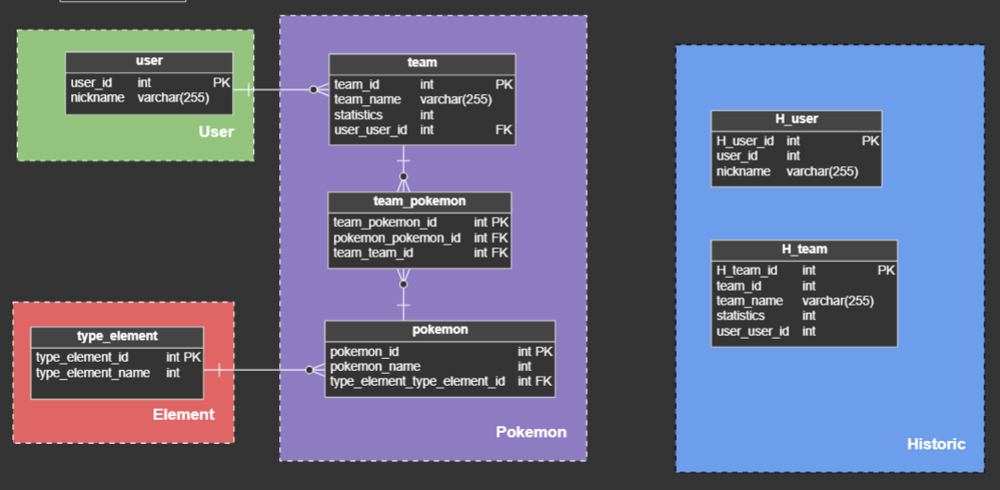

# Historias de usuario - Pokemon Team Builder 🛠️

## Valor 🌟
Proporcionar a los jugadores de Pokémon una herramienta intuitiva y completa 🎮 para la construcción y gestión de equipos competitivos 🥇.

## Historias de usuario 📖

10. Visualización de equipos Pokémon del usuario 👀.
20. Creación de nuevos equipos Pokémon 🆕.
30. Selección y gestión de Pokémon en equipos 📋.
40. Integración con PokeAPI para datos actualizados de Pokémon 🔄.
50. Visualización detallada de información de Pokémon 🔍.
60. Modificación de equipos Pokémon existentes ✏️.

## Whish List 🌠
1. Implementación de un sistema de recomendaciones basado en la efectividad de los tipos de Pokémon contra oponentes comunes 🤖.

## Objetivos 🎯
A. **Objetivo General**
Desarrollar "Pokemon Team Builder", una herramienta especializada 🏗️ para la creación y gestión eficiente de equipos Pokémon.

B. **Objetivos Específicos**
- Implementar una interfaz de usuario intuitiva 🖌️ para la selección y organización de equipos Pokémon.
- Integrar con PokeAPI para proporcionar información actualizada y detallada de los Pokémon 📈.
- Ofrecer funcionalidades para visualizar, modificar, agregar o eliminar equipos, y consultar información detallada de cada Pokémon 📚.

## Diseño de la base de datos 💾
A continuación se presenta el diseño completo de la base de datos:

