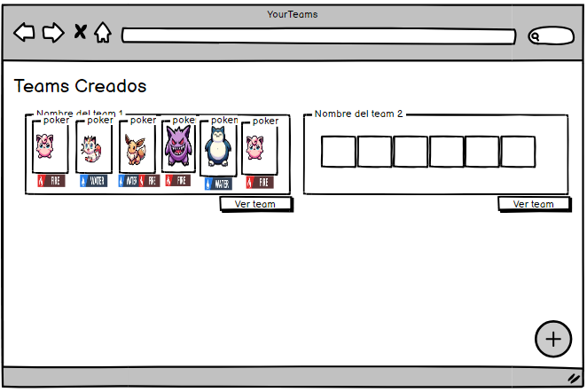

# Historia: Visualización de Equipos Pokémon 📜

- **Yo como**: Usuario jugador 🎮
- **Quiero**: Poder visualizar todos mis equipos Pokémon 🧐
- **Para**: Gestionar y organizar mis equipos de batalla 🏆.

## Pendientes de definición 🤔

1. *_pensando_*

## Especificación de requerimientos ✅

1. La pantalla debe mostrar todos los equipos Pokémon del usuario 📲.
2. Cada equipo debe presentar un resumen con los nombres y las imágenes de los Pokémon que lo componen 🖼️.
3. Debe haber una opción para seleccionar un equipo y verlo en detalle 🔍.
4. La interfaz debe ser clara y fácil de usar en dispositivos móviles y de escritorio 💻📱.

## Análisis 🕵️

### Pantalla de Visualización de Equipos Pokémon

Funcionamiento esperado:

1. El usuario accede a la sección "Mis Equipos" desde el menú principal 📋.
2. La pantalla muestra todos los equipos Pokémon que el usuario ha creado 🌟 o le permite crear uno si es su primera vez.
3. El usuario puede seleccionar cualquier equipo para verlo en detalle o editar su composición ✏️.



### Pantalla de Detalle de Equipo 🧐

## Criterios de aceptación 🎯

### Visualización de equipos existentes 📊

- **Dado**: Que el usuario ha iniciado sesión y tiene al menos un equipo creado.
- **Cuando**: Accede a la sección "Mis Equipos".
- **Entonces**: El sistema debe mostrar todos los equipos Pokémon del usuario.

### Selección de un equipo para ver detalles 🔎

- **Dado**: Que el usuario está en la pantalla "Mis Equipos".
- **Cuando**: Selecciona un equipo.
- **Entonces**: El sistema debe llevar al usuario a la pantalla de detalle de ese equipo.

## Diseño 🎨

### Pantalla de Visualización de Equipos Pokémon

Para obtener la lista de equipos del usuario:

**Request:**
```http
GET BASE_URL/api/v1/users/{userId}/teams
Accept: Application/json
Authorization: Bearer JWT
```

**Response: Exitoso statusCode: 200**
```json
[
  {
    "teamId": "team123",
    "teamName": "Equipo Alfa",
    "pokemons": [
      {
        "pokemonId": "001",
        "name": "Bulbasaur",
        "sprite": "url-de-la-imagen-bulbasaur.png"
      },
      // ... otros Pokémon
    ]
  },
  // ... otros equipos
]
```

**Response: No hay equipos statusCode: 404**
```json
{
  "message": "No teams found for this user."
}
```
