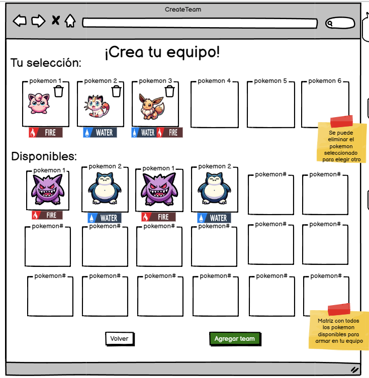

# Historia: Creación de Equipos Pokémon 🛠️

- **Yo como**: Usuario jugador 🧢
- **Quiero**: Poder crear y personalizar equipos Pokémon 📝
- **Para**: Prepararme para batallas y torneos competitivos 🥇.

## Pendientes de definición 📌

1. ¿Cuántos equipos puede tener un usuario? ¿Habrá un límite?
   R. Se definirá el límite de equipos por usuario tras la primera fase de pruebas.

## Especificación de requerimientos 📐

1. Los usuarios deben poder crear un nuevo equipo, asignándole un nombre único 🏷️.
2. Cada equipo puede estar compuesto por un máximo de 6 Pokémon, siguiendo las reglas estándar de la franquicia 🎮.
3. Los usuarios deben poder seleccionar Pokémon de una base de datos integrada, como PokeAPI, para añadirlos a sus equipos 🌐.
4. La interfaz para la creación de equipos debe ser intuitiva y guiar al usuario a través del proceso paso a paso 🖌️.

## Análisis 🕵️‍♂️

### Pantalla de Creación de Nuevo Equipo Pokémon

Funcionamiento esperado:

1. El usuario selecciona la opción "Crear Nuevo Equipo" en la interfaz principal 🆕.
2. Se presenta una pantalla con opciones para nombrar el equipo y añadir Pokémon 📋.
3. El usuario puede buscar y seleccionar Pokémon para añadir a su equipo 📝.
4. Una vez completado, el usuario puede guardar el equipo en su perfil 📥.



## Criterios de aceptación ✅

### Creación de un nuevo equipo Pokémon

- **Dado**: Que el usuario ha iniciado sesión en la aplicación 🌐.
- **Cuando**: Elige la opción de "Crear Nuevo Equipo" y completa el proceso de selección y personalización de Pokémon 🖱️.
- **Entonces**: El sistema debe guardar el nuevo equipo en el perfil del usuario con el nombre proporcionado 📝.

## Diseño 🎨

### Pantalla de Creación de Nuevo Equipo Pokémon

Para crear un nuevo equipo Pokémon:

**Request:**
```http
POST BASE_URL/api/v1/users/{userId}/teams
Content-Type: Application/json
Authorization: Bearer JWT
```

**Body:**
```json
{
  "teamName": "Equipo Legendaria",
  "pokemons": [
    {
      "pokemonId": "150",
      "nickname": "Mewtwo",
      "Type1": "Psychic",  // Tipo primario
      }
    },
    // ... otros Pokémon
  ]
}
```

**Response: Exitoso statusCode: 201**
```json
{
  "teamId": "newTeam123",
  "message": "Team created successfully."
}
```

**Response: Error statusCode: 400**
```json
{
  "message": "Error creating team. Please check the provided data."
}
```