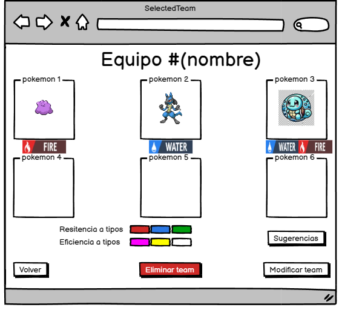

# Historia: Visualización de Equipo Pokémon 🏆

- **Yo como**: Jugador 🎮
- **Quiero**: Ver los Pokémon que componen mi equipo actual 📊
- **Para**: Evaluar mi alineación y hacer ajustes estratégicos para las batallas 🛠️.

## Especificación de requerimientos 📋

1. Los jugadores deben poder visualizar su equipo Pokémon actual 🔄.
2. La interfaz debe presentar una vista detallada del equipo a través de una integración con pokeapi 🌐.
3. Los jugadores deberían tener la opción de refrescar la vista para 
ver cualquier cambio reciente 🔄.




## Criterios de aceptación ✔️

### Visualización de Equipo Pokémon

- **Dado**: Que el jugador desea ver su equipo actual 📝.
- **Cuando**: Accede a la sección "Ver Equipo" 💾.
- **Entonces**: El sistema muestra los Pokémon que actualmente componen el equipo del jugador ✅.

## Diseño 🖌️

### Pantalla de Visualización de Equipo Pokémon

Para consultar la composición actual de un equipo Pokémon:

**Request:**
```http
GET BASE_URL/api/v1/users/{userId}/teams/{teamId}
Content-Type: Application/json
Authorization: Bearer JWT
```

**Response: Exitoso statusCode: 200**
```json
{
  "teamId": "team123",
  "pokemons": [
    {
      "pokemonId": "025",
      "nickname": "Pikachu",
      "moves": ["Thunderbolt", "Quick Attack", "Iron Tail", "Electro Ball"],
      "heldItem": "Light Ball",
      "stats": {
        "hp": 35,
        "attack": 55,
        "defense": 40,
        // ... otros stats
      }
    },
    // ... detalles de otros Pokémon
  ]
}
```

**Response: Error statusCode: 400**
```json
{
  "message": "Error retrieving team. Please check the provided data."
}
```

## Descripciones de las Tablas para la Selección de Equipos

### Tabla 'team'
Esta tabla contiene los equipos creados por los usuarios. Para seleccionar un equipo, se consultará esta tabla para obtener los detalles del equipo correspondiente al ID del equipo.

### Tabla 'team_pokemon'
Una vez seleccionado un equipo, esta tabla se consulta para obtener todos los Pokémon que pertenecen al equipo. Se utiliza para mostrar el detalle completo del equipo.

## Queries SQL para la Operación de Selección de Equipo

### Consulta para Obtener los Detalles de un Equipo Específico
Para obtener la información de un equipo específico junto con los Pokémon asociados, la consulta SQL sería algo como esto:
```sql
SELECT t.team_name, p.pokemon_id, p.pokemon_name
FROM team t
JOIN team_pokemon tp ON t.id = tp.team_team_id
JOIN pokemon p ON tp.pokemon_pokemon_id = p.pokemon_id
WHERE t.id = :teamId AND t.user_user_id = :userId;
```
En esta consulta, `:teamId` es el ID del equipo que el usuario ha seleccionado, y `:userId` es el ID del usuario, para asegurar que el usuario tenga permisos para ver el equipo.
