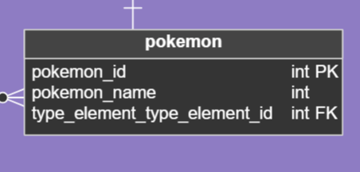

# Historia: Integración con PokeAPI para Datos Actualizados de Pokémon 🌐

- **Yo como**: Desarrollador de "Pokemon Team Builder" 💻
- **Quiero**: Integrar la aplicación con PokeAPI 🤝
- **Para**: Asegurar que los usuarios tengan acceso a la información más actualizada de Pokémon en todo momento 📈.

## Pendientes de definición 📝

1. ¿Con qué frecuencia se actualizarán los datos desde PokeAPI?
   R. Ezequiel considera que después de desplegar la aplicación se puede considerar el actualizar la información ya subida a la base de datos.

## Especificación de requerimientos 📄

1. La aplicación debe consumir datos de PokeAPI para obtener información actualizada de Pokémon, incluyendo estadísticas, movimientos, evoluciones, y más 🔄.
2. Los datos deben ser almacenados de manera que se minimice la latencia al acceder a ellos durante la creación y gestión de equipos 🚀.

## Análisis 🔍

### Proceso de Integración con PokeAPI

Funcionamiento esperado:

1. La aplicación realiza llamadas programadas a PokeAPI para recopilar datos necesarios 📅.
2. Los datos recopilados se procesan y almacenan en una base de datos local 🗃️.
3. Cuando los usuarios acceden a la información de Pokémon, la aplicación consulta primero la base de datos local 📚.
4. Si la información no está disponible o está desactualizada, se realiza una nueva solicitud a PokeAPI 🔄.

## Criterios de aceptación ✔️

### Actualización de datos de Pokémon

- **Dado**: Que la aplicación necesita información actualizada de un Pokémon específico 🆕.
- **Cuando**: Un usuario solicita datos de ese Pokémon 📲.
- **Entonces**: La aplicación debe proporcionar la información más reciente, mediante una solicitud a PokeAPI si es necesario 🔄.

## Diseño 🎨

### Proceso de Sincronización con PokeAPI

Para sincronizar y obtener datos de Pokémon:

**Request:**
```http
GET https://pokeapi.co/api/v2/pokemon/{pokemonId}
```

**Response: Exitoso statusCode: 200**
```json
{
  "pokemon_id": 25,
  "pokemon_name": "pikachu",
  "type_element_id": 2
}
```

**Response: Error statusCode: 404**
```json
{
  "message": "No Pokémon found with that ID."
}
```

## Descripción de la Tabla para Almacenar Datos de Pokémon



### Tabla 'pokemon'
Esta tabla se utiliza para almacenar información sobre cada Pokémon que se ha sincronizado desde PokeAPI. La estructura de la tabla es la siguiente:

- `pokemon_id`: Un identificador único para cada Pokémon. Este ID es una clave primaria (PK) y se alinea con el ID utilizado en PokeAPI para mantener la consistencia.
- `pokemon_name`: El nombre del Pokémon.
- `type_element_type_element_id`: Una clave foránea (FK) que enlaza a la tabla `type_element`, la cual almacena información detallada sobre los tipos de elementos de Pokémon, tales como fuego, agua, etc.

## Consulta SQL para Almacenar Datos de Pokémon Obtenidos de PokeAPI

### Insertar o Actualizar Información de un Pokémon
La siguiente consulta SQL se utiliza para guardar o actualizar la información de un Pokémon en la base de datos local, extrayendo la información directamente de las tablas que actúan como cache para los datos de PokeAPI:

```sql
INSERT INTO pokemon (pokemon_id, pokemon_name, type_element_type_element_id)
SELECT
  api_pokemon_id,
  api_pokemon_name,
  api_type_element_id
FROM
  pokeapi_cache
WHERE
  api_pokemon_id = :pokemonId
ON DUPLICATE KEY UPDATE
  pokemon_name = VALUES(pokemon_name),
  type_element_type_element_id = VALUES(type_element_type_element_id);
```