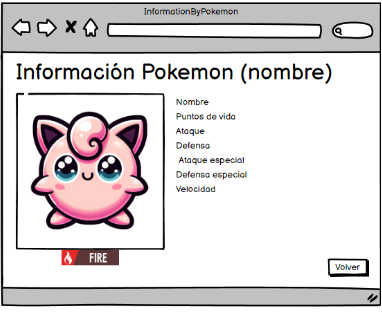

# Historia: Detalle de Información de Pokémon 📖

- **Yo como**: Usuario jugador de Pokémon 🎮
- **Quiero**: Ver información detallada de un Pokémon específico 🔍
- **Para**: Conocer mejor las características y habilidades para planificar mi estrategia de juego 📊.

## Pendientes de definición 📝

1. ¿Incluir información sobre evoluciones del pokemón?
   R. Se evaluará la inclusión de evoluciones en función de la retroalimentación de los usuarios en la fase de pruebas.

## Especificación de requerimientos 📋

1. La pantalla debe mostrar una imagen destacada del Pokémon seleccionado 🖼️.
2. Debe incluir información básica como el nombre, ataque, puntos de vida (HP) y tipo(s) de elemento 📄.
3. La información debe ser presentada de manera clara y concisa para una rápida comprensión 🧐.
4. La interfaz debe ser coherente con el diseño general de la aplicación para mantener la usabilidad 🎨.

## Análisis 🔍

### Pantalla de Más Información de Pokémon

Funcionamiento esperado:

1. El usuario selecciona un Pokémon desde cualquier lista o equipo en la aplicación 📋.
2. La aplicación muestra la pantalla de "Más Información de Pokémon" con todos los detalles relevantes 📑.
3. La pantalla incluye una imagen de alta calidad del Pokémon, su nombre, estadísticas de combate básicas y tipos de elemento 🌟.



## Criterios de aceptación ✔️

Gherkin

### Visualización de información detallada de Pokémon

- **Dado**: Que el usuario ha seleccionado un Pokémon para ver más detalles 🕵️‍♂️.
- **Cuando**: La pantalla de "Más Información de Pokémon" se carga 🖥️.
- **Entonces**: El sistema debe mostrar la imagen, nombre, ataque, HP y tipo(s) de elemento del Pokémon 📊.

## Diseño 🎨

### Pantalla de Más Información de Pokémon

Para obtener información detallada de un Pokémon:

**Request:**
```http
GET BASE_URL/api/pokemons/{pokemonId}
Accept: Application/json
```

**Response: Exitoso statusCode: 200**
```json
{
  "id": 25,
  "name": "Pikachu",
  "stats": {
    "hp": 35,
    "attack": 55,
    "defense": 40,
    "special-attack": 50,
    "special-defense": 50,
    "speed": 90
  },
  "types": [
    {
      "type": {
        "name": "electric"
      }
    }
  ],
  "sprite": "url-de-la-imagen-pikachu.png"
}
```

**Response: Error statusCode: 404**
```json
{
  "message": "Pokémon not found."
}
```
