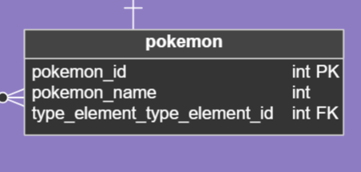

# Historia: Detalle de Información de Pokémon 📖

- **Yo como**: Usuario jugador de Pokémon 🎮
- **Quiero**: Ver información detallada de un Pokémon específico 🔍
- **Para**: Conocer mejor las características y habilidades para planificar mi estrategia de juego 📊.

## Pendientes de definición 📝

1. ¿Incluir información sobre evoluciones del pokemón?
   R. Ezequiel propone evaluar la inclusión de evoluciones en función de la retroalimentación de los usuarios en la fase de pruebas.

## Especificación de requerimientos 📋

1. La pantalla debe mostrar una imagen destacada del Pokémon seleccionado 🖼️.
2. Debe incluir información básica como el nombre, ataque, puntos de vida (HP) y tipo(s) de elemento 📄.
3. La información debe ser presentada de manera clara y concisa para una rápida comprensión 🧐.
4. La interfaz debe ser coherente con el diseño general de la aplicación para mantener la usabilidad 🎨.

## Análisis 🔍

### Pantalla de Más Información de Pokémon

Funcionamiento esperado:

1. El usuario selecciona un Pokémon desde cualquier lista o equipo en la aplicación 📋.
2. La aplicación muestra la pantalla de "Más Información de Pokémon" con todos los detalles relevantes 📑.
3. La pantalla incluye una imagen de alta calidad del Pokémon, su nombre, estadísticas de combate básicas y tipos de elemento 🌟.


## Criterios de aceptación ✔️

### Visualización de información detallada de Pokémon

- **Dado**: Que el usuario ha seleccionado un Pokémon para ver más detalles 🕵️‍♂️.
- **Cuando**: La pantalla de "Más Información de Pokémon" se carga 🖥️.
- **Entonces**: El sistema debe mostrar la imagen, nombre, ataque, HP y tipo(s) de elemento del Pokémon 📊.

## Diseño 🎨

### Endpoint para Detalles de Pokémon

Para obtener información detallada de un Pokémon específico utilizando el ID almacenado en la base de datos local que coincide con el ID de PokeAPI:

**Request:**
```http
GET BASE_URL/api/pokemons/{pokemonId}
Accept: Application/json
```

Entiendo que necesitas un ejemplo de cómo sería el `response` JSON en tu servicio, el cual debería reflejar los datos obtenidos de PokeAPI y asociados con el ID de tu tabla `pokemon`. Aquí te presento cómo podrías modificar la especificación de tu API para que el `response` JSON refleje esta integración:

```markdown
## Diseño de la API para Detalles de Pokémon

### Endpoint para Detalles de Pokémon

Para obtener información detallada de un Pokémon específico utilizando el ID almacenado en la base de datos local que coincide con el ID de PokeAPI:

**Request:**
```http
GET BASE_URL/api/pokemons/{pokemonId}
Accept: Application/json
```

**Response: Exitoso statusCode: 200**
Este `response` muestra cómo se vería la respuesta después de obtener los datos de PokeAPI usando el `pokemonId` de tu base de datos local:

```json
{
  "id": "id-obtenido-de-la-tabla-pokemon",
  "name": "nombre-obtenido-de-la-tabla-pokemon",
  "stats": {
    "hp": "valor-obtenido-de-pokeapi",
    "attack": "valor-obtenido-de-pokeapi",
    "defense": "valor-obtenido-de-pokeapi",
    "special-attack": "valor-obtenido-de-pokeapi",
    "special-defense": "valor-obtenido-de-pokeapi",
    "speed": "valor-obtenido-de-pokeapi"
  },
  "types": [
    {
      "type": {
        "name": "nombre-tipo-obtenido-de-pokeapi"
      }
    }
  ],
  "sprite": "url-sprite-obtenido-de-pokeapi"
}
```

**Response: Error statusCode: 404**
```json
{
  "message": "Pokémon not found."
}
```

## Descripción de las Tablas para Detalles de Pokémon



**Tabla 'pokemon'**
- `pokemon_id` INT PK: El identificador único para cada Pokémon, correspondiente al ID de PokeAPI.
- `pokemon_name` VARCHAR: El nombre del Pokémon.
- `type_element_type_element_id` INT FK: Una referencia a la tabla `type_element`, vinculando el Pokémon con su tipo elemental.

**Tabla 'type_element'**
- `type_element_id` INT PK: El identificador único para cada tipo elemental.
- `type_element_name` VARCHAR: El nombre del tipo elemental, como "fuego", "agua", "eléctrico", etc.

## Consulta SQL para Obtener Información de un Pokémon por ID

Para obtener los detalles de un Pokémon específico por su ID, la consulta SQL necesaria sería la siguiente:

```sql
SELECT 
    p.pokemon_id,
    p.pokemon_name,
    t.type_element_name
FROM 
    pokemon p
JOIN 
    type_element t ON p.type_element_type_element_id = t.type_element_id
WHERE 
    p.pokemon_id = :pokemonId;
```
