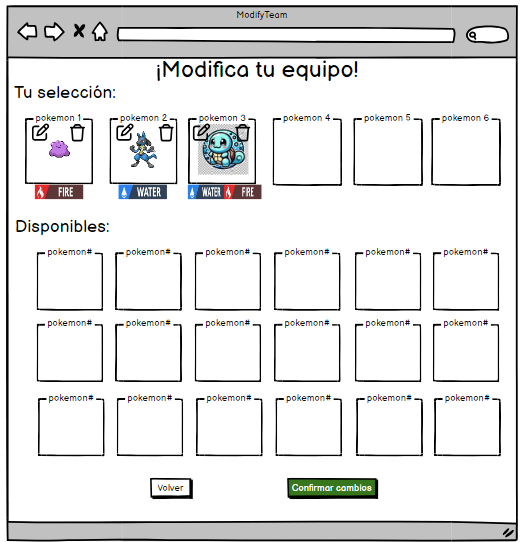

# Historia: Edición de Equipos Pokémon Existentes ✏️

- **Yo como**: Entrenador Pokémon 🧢
- **Quiero**: Poder editar los equipos Pokémon que ya he creado 🔄
- **Para**: Ajustar mi estrategia y mejorar mi rendimiento en las batallas 🏆.

## Pendientes de definición 📝

1. ¿Se permitirá cambiar el nombre del equipo durante la edición?
   R. Se decidirá tras revisar las normativas de los torneos y recibir comentarios de los usuarios.

## Especificación de requerimientos 📄

1. Los usuarios deben ser capaces de modificar la composición de sus equipos, incluyendo añadir o quitar Pokémon 🛠️.
2. Debe ser posible cambiar los movimientos, objetos equipados y otras configuraciones personalizadas de los Pokémon dentro del equipo 🎮.
3. La interfaz de edición debe ser intuitiva, permitiendo realizar cambios de manera rápida y eficiente 🖱️.
4. Los usuarios deben poder guardar los cambios realizados o descartarlos si así lo desean 💾.

## Análisis 🔍

### Pantalla de Edición de Equipos Pokémon

Funcionamiento esperado:

1. El usuario accede a la sección "Editar Equipo" desde la pantalla de gestión de equipos 📝.
2. La pantalla muestra la composición actual del equipo y permite realizar cambios en ella 🔄.
3. El usuario puede añadir o quitar Pokémon, cambiar configuraciones y guardar los cambios realizados 📥.



## Criterios de aceptación ✔️

### Edición de un equipo Pokémon existente

- **Dado**: Que el usuario selecciona un equipo existente para editarlo 📑.
- **Cuando**: Realiza cambios en la composición o configuración del equipo y elige "Guardar Cambios" ✅.
- **Entonces**: El sistema debe actualizar el equipo con los nuevos cambios y reflejarlos en el perfil del usuario 🔄.

## Diseño 🎨

### Pantalla de Edición de Equipos Pokémon

Para editar un equipo Pokémon existente:

**Request:**
```http
PUT BASE_URL/api/v1/users/{userId}/teams/{teamId}
Content-Type: Application/json
Authorization: Bearer JWT
```

**Body:**
```json
{
  "teamName": "Equipo Legendaria",
  "pokemons": [
    {
      "pokemonId": "150",
      "nickname": "Mewtwo",
      "moves": ["Psystrike", "Shadow Ball", "Ice Beam", "Calm Mind"],
      "heldItem": "Life Orb",
      "stats": {
        "hp": 106,
        "attack": 110,
        "defense": 90,
        // ... otros stats
      }
    },
    // ... ajustes para otros Pokémon
  ]
}
```

**Response: Exitoso statusCode: 200**
```json
{
  "teamId": "team123",
  "message": "Team updated successfully."
}
```

**Response: Error statusCode: 400**
```json
{
  "message": "Error updating team. Please check the provided data."
}
```
